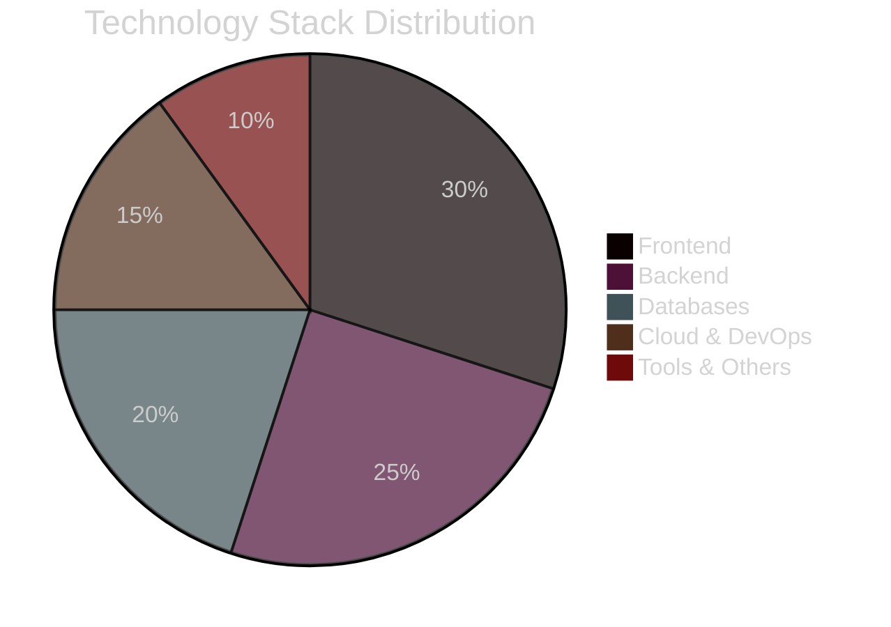

<div align="center">

<!-- EPIC ANIMATED HEADER WITH PARTICLES -->


<!-- HOLOGRAPHIC TYPING EFFECT -->
<p align="center">
  <a href="https://git.io/typing-svg">
    
  </a>
</p>

<!-- ANIMATED BADGES WITH NEON GLOW -->
<p align="center">
  
  
  
  
</p>

<!-- PROFILE VIEWS COUNTER WITH STYLE -->
<p align="center">
  
  
  
</p>

</div>

---

<!-- NEON RAINBOW LINE -->


<div align="center">

## 🌟 WELCOME TO MY DIGITAL COSMOS 🌟

</div>


### 💫 ABOUT THE ARCHITECT

```javascript
class DeveloperExtraordinaire {
    constructor() {
        this.name = "Abdullah Bin Ata";
        this.role = "Full Stack Sorcerer";
        this.location = "🌍 Building from Pakistan";
        this.currentMission = "Revolutionizing Web3.0";
    }

    get techStack() {
        return {
            frontend: ["React", "Next.js", "TypeScript", "Tailwind CSS"],
            backend: ["Node.js", "Express", "MongoDB", "PostgreSQL"],
            cloud: ["Firebase", "AWS", "Netlify", "Vercel"],
            tools: ["Docker", "Git", "Figma", "VS Code"],
            expertise: ["MERN Stack", "API Development", "Cloud Integration"]
        };
    }

    get dailyRoutine() {
        return [
            "☕ Coffee++",
            "💻 Code(); // Write elegant solutions",
            "🐛 Debug(); // Squash bugs mercilessly", 
            "🚀 Deploy(); // Ship amazing products",
            "📚 Learn(); // Stay ahead of the curve",
            "🔁 repeat();"
        ];
    }

    getCurrentFocus() {
        return "🎯 Mastering MERN Stack & Cloud Architecture";
    }

    getFunFact() {
        return "⚡ I don't write bugs, I create undocumented features! 😄";
    }
}

const abdullah = new DeveloperExtraordinaire();
console.log("Ready to build something extraordinary? Let's connect! 🚀");
```

<br clear="right"/>

### 🎯 MISSION CONTROL

```diff
+ 🔭 Currently Engineering: Next-Gen MERN Applications
+ 👯 Collaboration Mode: Open for Revolutionary Projects
+ 🤝 Seeking Partners In: Cloud Integration & API Mastery
+ 🌱 Learning Path: Advanced Microservices & DevOps
+ 💬 Expert Topics: MERN Stack, Web Architecture, System Design
+ ⚡ Secret Weapon: Turning Complex Problems into Elegant Solutions
+ 🎮 Side Quest: Building AI-Powered Web Applications
```

<!-- NEON RAINBOW LINE -->


## 🌐 CONNECT ACROSS THE METAVERSE

<div align="center">

<a href="https://www.linkedin.com/in/abdullah-bin-ata-804074299/">
  
</a>
<a href="https://stackoverflow.com/users/24810740/abdullah-ata">
  
</a>
<a href="https://github.com/Abdullahata450">
  
</a>
<a href="mailto:your.email@example.com">
  
</a>

</div>

<!-- NEON RAINBOW LINE -->


## 💻 TECH ARSENAL & WEAPONS OF CHOICE

<div align="center">

### ⚡ PROGRAMMING LANGUAGES

<table>
<tr>
<td align="center" width="96">

<br>JavaScript
</td>
<td align="center" width="96">

<br>C++
</td>
<td align="center" width="96">

<br>Java
</td>
<td align="center" width="96">

<br>PHP
</td>
<td align="center" width="96">

<br>Dart
</td>
</tr>
</table>

### 🎨 FRONTEND MASTERY

<table>
<tr>
<td align="center" width="96">

<br>React
</td>
<td align="center" width="96">

<br>Next.js
</td>
<td align="center" width="96">

<br>HTML5
</td>
<td align="center" width="96">

<br>CSS3
</td>
<td align="center" width="96">

<br>Tailwind
</td>
<td align="center" width="96">

<br>Bootstrap
</td>
</tr>
</table>

### ⚙️ BACKEND POWERHOUSE

<table>
<tr>
<td align="center" width="96">

<br>Node.js
</td>
<td align="center" width="96">

<br>Express
</td>
<td align="center" width="96">

<br>MongoDB
</td>
<td align="center" width="96">

<br>MySQL
</td>
<td align="center" width="96">

<br>PostgreSQL
</td>
<td align="center" width="96">

<br>Firebase
</td>
</tr>
</table>

### 🛠️ TOOLS & PLATFORMS

<table>
<tr>
<td align="center" width="96">

<br>Git
</td>
<td align="center" width="96">

<br>GitHub
</td>
<td align="center" width="96">

<br>VS Code
</td>
<td align="center" width="96">

<br>Figma
</td>
<td align="center" width="96">

<br>Netlify
</td>
<td align="center" width="96">

<br>Vercel
</td>
</tr>
</table>

</div>

<!-- NEON RAINBOW LINE -->


## 📊 PERFORMANCE METRICS & BATTLE STATS

<div align="center">

<!-- GITHUB STATS WITH CUSTOM THEME -->


<!-- STREAK STATS -->


<!-- TOP LANGUAGES -->


<!-- CONTRIBUTION GRAPH -->


</div>

<!-- NEON RAINBOW LINE -->


## 🏆 ACHIEVEMENT SHOWCASE & TROPHY COLLECTION

<div align="center">


</div>

<!-- NEON RAINBOW LINE -->


## 💡 WISDOM FROM THE CODE REALM

<div align="center">


</div>

<!-- NEON RAINBOW LINE -->


## 🎯 TOP CONTRIBUTED REPOSITORIES

<div align="center">


</div>

<!-- NEON RAINBOW LINE -->


## 🐍 CONTRIBUTION SNAKE - WATCH IT DEVOUR MY COMMITS!

<div align="center">

<picture>
  <source media="(prefers-color-scheme: dark)" srcset="https://raw.githubusercontent.com/platane/platane/output/github-contribution-grid-snake-dark.svg">
  <source media="(prefers-color-scheme: light)" srcset="https://raw.githubusercontent.com/platane/platane/output/github-contribution-grid-snake.svg">
  
</picture>

</div>

<!-- NEON RAINBOW LINE -->


## 📈 DETAILED ANALYTICS DASHBOARD

<div align="center">

### 📅 Commit Activity


### ⏰ Coding Time Distribution


</div>

<!-- NEON RAINBOW LINE -->


<div align="center">

## 💼 CURRENT PROJECTS IN THE LAB

<table>
<tr>
<td align="center">

</td>
<td align="center">

</td>
</tr>
</table>

</div>

<!-- NEON RAINBOW LINE -->


<div align="center">

## 🎨 SKILL PROFICIENCY RADAR



</div>

<!-- NEON RAINBOW LINE -->


<div align="center">

## 🌈 PROFILE ENGAGEMENT METRICS


</div>

<!-- NEON RAINBOW LINE -->


<div align="center">

## 🚀 LET'S BUILD SOMETHING LEGENDARY TOGETHER!

### 💭 Open to collaborations on:
```
✦ Innovative Web Applications
✦ MERN Stack Projects  
✦ API Development & Integration
✦ Cloud Architecture Solutions
✦ Open Source Contributions
```

### 📫 How to reach me:
```
→ LinkedIn: Connect with me professionally
→ GitHub: Check out my repositories
→ Stack Overflow: Technical discussions
→ Email: Let's discuss your next big idea
```

<br>

### ⭐ If you find my work interesting, consider:
```diff
+ ⭐ Starring my repositories
+ 👀 Following my GitHub journey
+ 🤝 Collaborating on exciting projects
+ 💬 Reaching out for tech discussions
```

</div>

---

<div align="center">

<!-- ANIMATED FOOTER WAVE -->


### 🌟 Thank You For Visiting! 🌟


<br>

**"Code is poetry written in logic. Let's write a masterpiece together!"** ✨

<br>

[](https://github.com/Abdullahata450)
[](https://github.com/Abdullahata450)
[](https://github.com/Abdullahata450)

<sub>© 2024 Abdullah Bin Ata | All Rights Reserved</sub>

</div>
